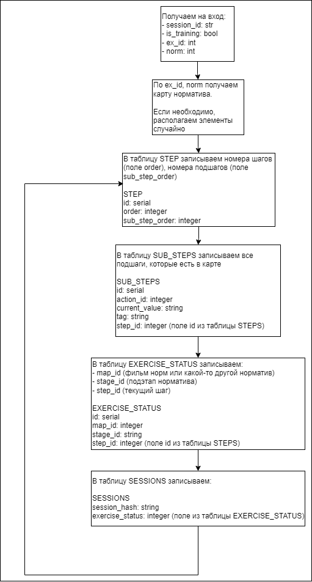

# eed-backend2
Перепроектированный eed-backaend

Для запуска проекта требуется:
1. прописать в консоли команду: pip install -r requirements.txt
2. если используется прокси, то не установившиеся пакеты установить с помощью команды: pip install --proxy http://адрес:порт название_библиотеки --no-build-isolation --no-use-pep517 -vv
4. создать базу данных и таблицы с помощью скрипта из файла db_config.sql.
При этом необходимо выполнить сначала первую строчку, а затем в другом запросе - все остальные
5. для возможности работы с БД, необходимо в папке configs создать файл db_connection.yaml и заполнить по следущей структуре: 

connect_params: 
  user: "postgres" # имя пользователя 
  database: "eed_backend_2" # имя базы данных 
  password: "postgres" # пароль от базы данных 
  host: "localhost" # адрес хоста 
  port: 5432 # порт

5. запустить проект с помощью команды python server.py (если появилась надпись "SERVER ON", то все верно)

### Формат json карты:
```json5
{"step_1": 
  {
    "step": 0, // номер шага 
    "actions_for_step": 2, // сколько действие пользователь должен сделать в текущем шаге
    "count_action": 1, // количество событий, которые будут исполнены аппаратурой после выполнеия шага
    "count_next": 1, // количество действий в следующем шаге (необходимо для подсветки элементов)
    "order": true, // важен ли порядок выполнения подшагов
    "sub_steps": // подшаги, которые делает пользователь в шаге
    [
      {
        "sub_step": 0, // номер подшага
        "action_id": 11012, // id элемента
        "current_value": "on", // значение, которое ожидается
        "tag": "lever", // тип элемента
        "array_actions": // массив действий выполняемых после подшага
        [  
          {
            "element_id": 1020,   // id элемента, которому нужно выставить положение current_value
            "current_value": "on"
          }
        ]
      },
      {
        "sub_step": 1,
        "action_id": 1019,
        "current_value": "on",
        "tag": "lever",
        "array_actions": // массив действий выполняемых после подшага
        [ ]  // нет действий после шага
      }
    ],
    "array_actions": // действия, которые будут выполнены после завершения всех подшагов 
    [
      {
        "apparat_id": 6, // номер блока, на котором подсвечивать элемент
        "action_id": 6401,
        "action_value": 67,
        "tag": "arrow"
      },
      {
        "apparat_id": 7,
        "action_id": 7007,
        "action_value": "on",
        "tag": "lamp"
      }
    ],
    "next_actions": // следующие действия, которые должны быть выполнены пользователем
    [
      {
        "apparat_id": 7,
        "next_id": 7008, // id элемента, который нужно подсветить 
        "current_value": "on",
        "tag": "button"
      }
    ],
    "annotation": "Выключить звук нажатием кнопки «ВЫКЛ. ЗВ.» на ЩКНЧ." // описание следующего шага
  },
}
```

__Нулевой шаг__
```json5
{"step_0": 
  {
    "step": 0,
    "actions_for_step": 2, // например, 2 действия должны быть 
    "count_action": 0,
    "count_next": 1, 
    "order": true,
    "sub_steps": 
    [

    ],
    "array_actions": // в случае, если это 1-ый поднорматив норматива, то в array_actions могут быть команды для перевода элементов в случайные положения
    [
      {
        "apparat_id": 6,
        "action_id": 6401,
        "action_value": 67,
        "tag": "arrow"
      },
      {
        "apparat_id": 7,
        "action_id": 7007,
        "action_value": "on",
        "tag": "lamp"
      }
    ],
    "next_actions":
    [
      {
        "apparat_id": 7,
        "next_id": 7008,
        "tag": "button",
      }
    ],
    "annotation": "Выключить звук нажатием кнопки «ВЫКЛ. ЗВ.» на ЩКНЧ."
  },
}

```

__Последний шаг__
В последнем шаге 
```json5
"next_actions": [{"name": "nan"}]
```

__Логика работы__

